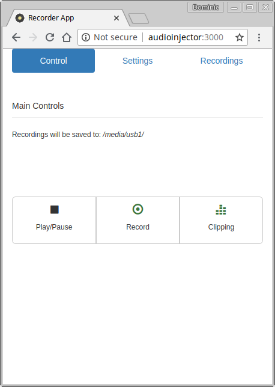
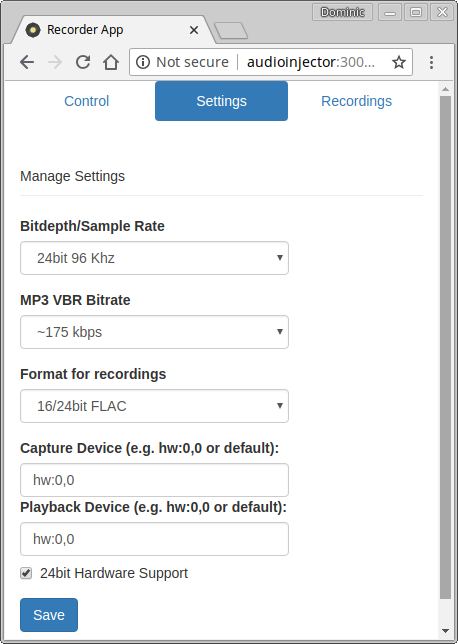
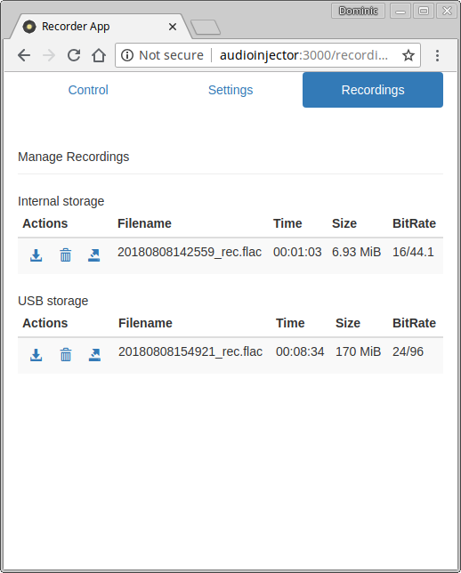

# Recorder App
 

**Linux only**. A Node/Express app for recording audio from line-in or mic sources. 

Recorder App is targeted at SBCs such as the Raspberry Pi with an audio HAT such as the [Pisound](https://blokas.io/pisound/) or the [Audioinjector](http://www.audioinjector.net/), but can be used on any Linux system with an audio input.

## Features:
- Fully configurable sample formats and rates (depending on audio card capabilities).
- Recording to lossless lossless FLAC (16/24bit) or WAV (16/32bit) formats.
- Low CPU usage. Recording 24/96 FLAC uses 7% CPU (total) on raspberry Pi 3.
- Re-encoding in VBR mp3 format.
- Remote control via Web interface or API.
- Web interface optimised for Mobile devices.
- Audio clipping detection.
- Configurable for push button control (example configs included).
- Configurable to run as a service (example configs included).
- Configurable to auto mount USB drives to store recordings (example configs included).

## Dependencies
Requires libflac8 (FLAC recordings) libudev-dev (USB media) jq (JSON parser for button control) pmount (USB media) mediainfo (audio file info) ffmpeg (re-encoding) bc (for led control).

Install using `sudo apt install -y libflac8 libudev-dev jq pmount mediainfo ffmpeg bc` on Debian/Ubuntu based systems.

## Running
Clone the repo, install node modules. 
`git clone https://github.com/dmooney65/recorder-app.git` 
`cd recorder-app` 
`npm install`

Start the app 
`npm start`

Open a Web browser and navigate to http://localhost:3000